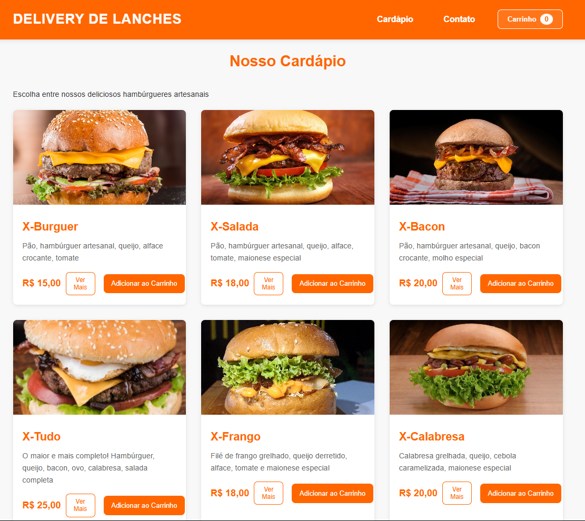

# Sistema de Delivery - Documentação

## 📝 Descrição
Sistema completo de delivery para restaurantes/lanchonetes, desenvolvido com HTML, CSS e JavaScript puro. O sistema oferece uma interface moderna e responsiva, com funcionalidades completas de cardápio, carrinho de compras e sistema de pedidos via WhatsApp.

## 🚀 Funcionalidades

### 1. Interface do Usuário
- Design moderno e responsivo
- Cards de produtos com imagens e descrições
- Modal detalhado para cada produto
- Navegação intuitiva
- Animações suaves de transição

### 2. Cardápio
- Exibição de produtos em grid
- Imagens otimizadas
- Descrições detalhadas
- Preços claramente visíveis
- Botão de "Adicionar ao Carrinho"
- Modal com informações completas do produto

### 3. Carrinho de Compras
- Adição/remoção de itens
- Ajuste de quantidades
- Cálculo automático de valores
- Exibição de subtotal
- Taxa de entrega fixa (R$ 2,00)
- Taxa adicional para pagamento em cartão (1.5%)
- Resumo completo do pedido

### 4. Sistema de Endereço
- Integração com OpenStreetMap e Leaflet
- Busca de endereços
- Preenchimento automático via CEP
- Opção de entrada manual de endereço
- Campos para complemento e referência

### 5. Finalização do Pedido
- Múltiplas formas de pagamento:
  - Dinheiro (com opção de troco)
  - Cartão de Crédito
  - Cartão de Débito
  - PIX
- Mensagem formatada para WhatsApp incluindo:
  - Lista detalhada dos itens
  - Quantidades e valores
  - Endereço de entrega
  - Forma de pagamento
  - Troco (se necessário)
- Popup de confirmação com:
  - Mensagem de agradecimento
  - Tempo estimado de entrega
  - Animação personalizada

## 🛠️ Tecnologias Utilizadas
- HTML5
- CSS3
- JavaScript (ES6+)
- Leaflet (mapas)
- OpenStreetMap
- Font Awesome (ícones)

## 📦 Estrutura do Projeto
```
.
├── assets/
│   ├── css/
│   │   └── index.css
│   ├── js/
│   │   └── script.js
│   └── images/
├── index.html
└── README.md
```

## ⚙️ Configurações

### Configurações do WhatsApp
O número do WhatsApp está configurado no arquivo `assets/js/script.js`:
```javascript
const numeroWhatsApp = '5584991639078';
```

### Taxas e Valores
No arquivo `assets/js/script.js`:
```javascript
const TAXA_CARTAO = 0.015; // 1.5%
const TAXA_ENTREGA_BASE = 2.00;
const DISTANCIA_BASE = 3; // km
```

## 📱 Responsividade
O sistema é totalmente responsivo e se adapta a diferentes tamanhos de tela:
- Desktop (> 1024px)
- Tablet (768px - 1024px)
- Mobile (< 768px)

## 🔧 Instalação e Uso
1. Clone o repositório
2. Abra o arquivo `index.html` em um servidor web
3. Configure o número do WhatsApp no arquivo `script.js`
4. Personalize as imagens e informações dos produtos
5. Ajuste as taxas conforme necessário

## 💡 Melhorias Futuras Sugeridas
1. Integração com sistema de pagamento online
2. Sistema de login para clientes
3. Área administrativa
4. Histórico de pedidos
5. Sistema de cupons de desconto
6. Integração com APIs de delivery

## 📄 Licença
Este projeto está sob a licença MIT.

## 👨‍💻 Autor
Hudson Oliveira

---
⌨️ com ❤️ por [Hudson Oliveira]

# 🍔 Delivery de Lanches  

Sistema web para delivery de lanches com interface moderna e funcionalidades completas.  

## 🚀 Sobre o Projeto  
Este projeto é uma aplicação interativa de **delivery de lanches**, construída com **HTML, CSS e JavaScript**.  

🔹 **Objetivo**: Criar uma plataforma simples para que os usuários possam escolher lanches, adicionar ao carrinho e finalizar o pedido.  
🔹 **Funcionalidades**:  
- Listagem de lanches disponíveis  
- Adição de lanches ao carrinho  
- Cálculo dinâmico do total do carrinho  
- Escolha da forma de pagamento (Dinheiro, Cartão, Pix)  
- Envio do pedido para WhatsApp  

## 🛠️ Tecnologias Utilizadas  
- HTML5  
- CSS3  
- JavaScript (Vanilla)  
- Google Maps API  

## 📷 Prévia  
  

## Configuração  

1. Clone o repositório  
2. Substitua `YOUR_API_KEY` no arquivo `index.html` pela sua chave da API do Google Maps  
3. Abra o arquivo `index.html` em um servidor web  

## Estrutura do Projeto  

```
.
├── assets/
│   ├── css/
│   │   └── index.css
│   ├── js/
│   │   ├── script.js
│   │   └── maps.js
│   └── images/
│       └── [imagens do projeto]
├── index.html
└── README.md
```  

## Funcionalidades do Carrinho  

- Adição/remoção de itens  
- Controle de quantidade  
- Cálculo de subtotal  
- Taxa de cartão (1.5%)  
- Taxa de entrega dinâmica  

## Sistema de Endereço  

- Busca por CEP  
- Seleção via mapa  
- Autopreenchimento de endereço  
- Validação de área de entrega  

## Formas de Pagamento  

- Dinheiro (com troco)  
- Cartão de Crédito  
- Cartão de Débito  
- PIX  

## Contribuição  

1. Faça um Fork do projeto  
2. Crie uma branch para sua feature (`git checkout -b feature/AmazingFeature`)  
3. Commit suas mudanças (`git commit -m 'Add some AmazingFeature'`)  
4. Push para a branch (`git push origin feature/AmazingFeature`)  
5. Abra um Pull Request  

## Licença  

Este projeto está sob a licença MIT. Veja o arquivo `LICENSE` para mais detalhes.  

---

# 🍔 Delivery of Sandwiches (English Version)  

An interactive web application that simulates a **sandwich delivery service**, allowing users to add items to their cart and finalize the order via WhatsApp.  

## 🚀 About the Project  
This project is an interactive **sandwich delivery** application built using **HTML, CSS, and JavaScript**.  

🔹 **Objective**: Create a simple platform for users to choose sandwiches, add them to the cart, and complete their order.  
🔹 **Features**:  
- Display available sandwiches  
- Add sandwiches to the cart  
- Dynamic cart total calculation  
- Choose payment method (Cash, Card, Pix)  
- Send order to WhatsApp  

## 🛠️ Technologies Used  
- HTML5  
- CSS3  
- JavaScript (ES6)  

## 📷 Preview  
  
